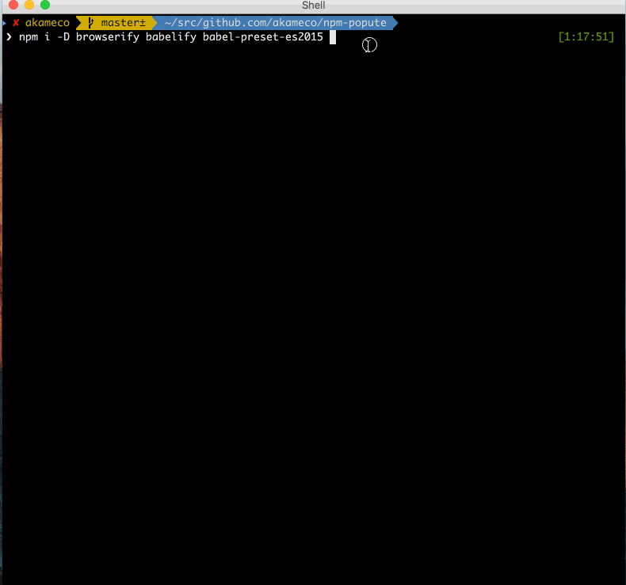

# npm-popute [](https://travis-ci.org/akameco/npm-popute)

[](https://greenkeeper.io/)

> watch '[ポプテピピック](http://mangalifewin.takeshobo.co.jp/rensai/popute/)' while running `npm install`

**Note**: Images are only displayed inline for [users of iTerm2 using version 2.9 or greater](https://www.iterm2.com/images.html).

## Demo



## Installation

```
$ npm install -g npm-popute
```

## Usage

```
$ npm-popute install -S react react-dom
```

## Recommend

Add this to ~/.bashrc or ~/.zshrc:

```
alias npm=npm-popute
```

## License

MIT
